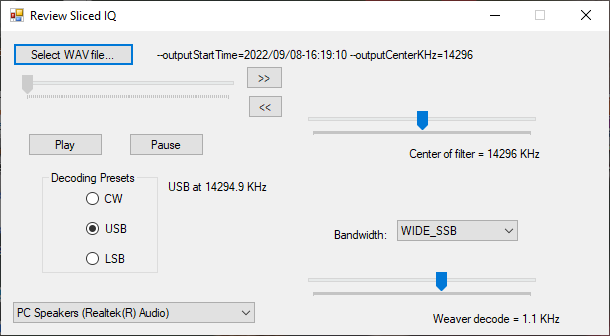

# ReviewRecordedIQ
Tools to process recorded IQ into audio in two steps.

Modern SDR's can accomplish IQ recording of, for example, a 192KHz segment of an amateur band. Here
are a couple of tools to review what might be in such an IQ recording. This tool set operates in
two distinct steps:

0. The recorded input must be in Microsoft .WAV (aka RIFF) file format recorded at 192K samples per second,
each sample a 32 bit float, and in stereo (in-phase in the Left channel and quadrature-phase in the Right.)
Such a recording occupies (about) 1.5M bytes per second of recording (or 5.5GB per hour.)

1. The SliceIQ tool in this project takes such a WAV file as its input, and produces a "sliced" IQ
file as its output. The "Slice" is a slice both in the time domain&mdash;between two time stamps&mdash;and
also in the frequency domain. Its output is fixed at a 12KHz sample rate (compared to 192KHz in
the input) which is a 16:1 reduction in file size per second of recording. Its output file format is
the same RIFF file format as its input (and it turns out other SDR programs like <a href='http://hdsdr.de'>HDSDR</a> can play
the sliced result.)

2. The ReviewRecordedIQ tool is compact SDR implementation designed to consume the output of
step (1). That is, it takes a .WAV input at 12000 samples per second and plays it through a Windows sound device.

# SliceIQ
SliceIQ is a command line program. It takes the following command line arguments:

<code>
<pre>
**
** SliceIQ <i>InputFile.wav</i> <i>OutputFile.wav</i>
**
** The input is described by these optional command line arguments:
** --inputCenterKHz=nnnnn
** --inputIsFlipped   The I channel, by definition, is ahead of Q by 90 degrees, but this flips it.
** --inputStartTime=YYYY/MM/DD-HH:MM:SS
**
** The output subset is defined by these command line arguments
** --outputCenterKHz=nnnnn
** --outputIntervalSeconds=nnnn
** --outputStartOffsetSeconds=nnnnn
** --outputStartTime=YYYY/MM/DD-HH:MM:SS
**      Those last two are redundant with each other. If both are specified, outputStartOffsetSeconds is used
</pre>
</code>

To repeat in English: SliceIQ takes an input .WAV file (which must be 192KHz stereo) and writes an output file 
(which is 12KHz stereo). The command line arguments determine what time span of the input appears in the output,
and what frequency span of the input appears in the output.

SliceIQ compiles on Windows and on Linux.

Its output WAV file is also a standard format for SDR recordings such that the ReviewRecordedIQ
program here can decoded it, as can, for example, <a href='https://hdsdr.de/'>HDSDR</a>.

# ReviewRecordedIQ

ReviewRecordedIQ is a .NET application that presents the following interface. ReviewRecordedIQ
has an advantage over HDSDR when reading the output of SliceIQ. SliceIQ writes
its slicing parameters into its output .WAV file in a format that ReviewRecordedIQ can read. That
enables ReviewRecordedIQ to display the frequency of the original recorded bandwidth (around 14.296MHz
in this screen shot.) 

To use it:
Check that the audio output device in the lower left corner is where you want to
hear the radio output. Then <i>Select WAV file..</i> and pick an output file created by
SliceIQ. Press <i>Play</i> and the audio decoded according to the three SDR
decoding parameters on the far right (center frequency, bandwidth, and weaver
frequency.) You don't need to know who Weaver was, nor what a weaver frequency
is. Just press one of the "Decoding Presets".

<a href='http://www.csun.edu/~skatz/katzpage/sdr_project/sdr/ssb_rcv_signals.pdf'>Here</a> is a reference on the Weaver method:
<a href='http://www.csun.edu/~skatz/katzpage/sdr_project/sdr/ssb_rcv_signals.pdf'>http://www.csun.edu/~skatz/katzpage/sdr_project/sdr/ssb_rcv_signals.pdf</a>

The Upper left corner controls allow you to scroll in the time domain. The >> and << buttons skip forward and backwards 5 seconds,
the Pause stops (which also enables the scroll bar, to move to a time point.)

# Architecture

SliceIQ is in C++ using the standard C++ library. it builds in Visual Studio and the Gnu g++ compiler on linux.

The ReviewRecordedIQ application's main window is in .NET and C# and runs only on Windows. However,
it uses the SimpleSdrImpl in the SimpleSdr folder, and that class compiles using g++. It is left as an
exercise to the reader to construct a Linux user interface.
